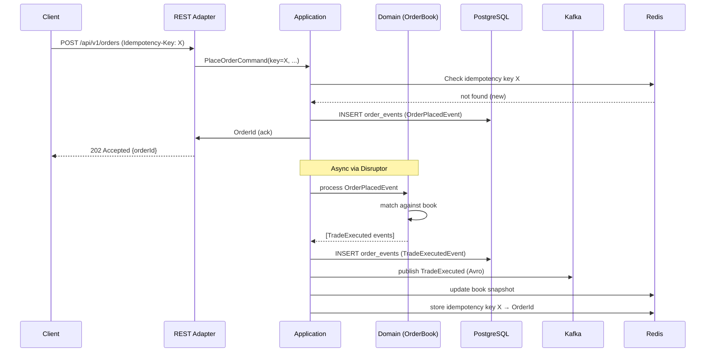

# Arquitetura — Athena Matching Engine

## C4: Contexto

A Athena é um sistema independente que recebe ordens de clientes via três protocolos (REST, gRPC, WebSocket), casa compras com vendas conforme prioridade preço-tempo, e publica execuções em stream para sistemas downstream. Não há autenticação de usuário final nesta fase — o foco é no núcleo de matching.

```
[Cliente/FIX Gateway] → REST/gRPC/WS → [Athena] → Kafka → [Market Data Service]
                                                  ↓
                                              PostgreSQL (auditoria/replay)
                                              Redis (projeções quentes)
```

## C4: Containers

| Container | Tecnologia | Responsabilidade |
|-----------|-----------|-----------------|
| Matching Engine | Java 21 / Spring Boot 3.3 | Core do sistema — recebe ordens, casa, publica |
| PostgreSQL 16 | RDBMS | Event store (source of truth), projeções lentas |
| Redis 7 | In-memory store | Book snapshots, last trade, idempotency keys |
| Kafka 3.7 | Event streaming | Publicação de execuções e market data |
| Schema Registry | Confluent 7.6 | Contrato Avro entre producers e consumers |

## C4: Componentes (dentro do Matching Engine)

```
bootstrap (Spring Boot wiring)
    │
    ├── adapter-rest      ← HTTP requests → application commands
    ├── adapter-grpc      ← gRPC calls    → application commands
    ├── adapter-ws        ← WS messages   → subscriptions / events out
    │
    ├── application       ← use cases, ports (inbound/outbound)
    │       │
    │       └── domain    ← OrderBook, Order, Trade, matching logic (pure Java)
    │
    ├── adapter-persistence ← PostgreSQL via Spring Data JDBC
    ├── adapter-kafka       ← Avro producers / consumers
    ├── adapter-redis       ← Lettuce client, snapshot cache
    └── observability       ← Micrometer, OTel, logstash encoder
```

## Arquitetura Hexagonal

O domínio não conhece nada fora de `java.*`. A fronteira é enforçada por ArchUnit no CI — uma violação quebra o build.

```
Adapter (Spring) → Port (interface Java) → Application Service → Domain (pure)
```

Ports de entrada (`port/inbound`): definem o que o sistema aceita fazer.
Ports de saída (`port/outbound`): definem o que o sistema precisa do mundo externo.
Os adapters implementam as portas de saída e chamam as portas de entrada.

## CQRS

**Command side** (escrita):
- Recebe `PlaceOrderCommand` via REST/gRPC
- Valida `Idempotency-Key` no Redis
- Persiste `OrderPlacedEvent` no Postgres (outbox)
- Publica no ring buffer do Disruptor
- Retorna `OrderId` imediatamente (ack síncrono, matching assíncrono)

**Query side** (leitura):
- `GET /books/{symbol}` lê snapshot do Redis (atualizado pelo event processor)
- `GET /trades` lê projeção do Postgres
- Eventual consistency declarada — headers `X-Book-Sequence` e `X-Last-Updated`

## Event Sourcing

Todo estado do `OrderBook` deriva de eventos imutáveis persistidos na tabela `order_events`:

```sql
order_events(id, symbol, sequence, event_type, payload JSONB, occurred_at, idempotency_key)
```

No startup, o engine faz replay de todos os eventos para reconstruir o estado em memória. Para performance, snapshots periódicos evitam replay completo (melhoria planejada).

## Single-Writer Principle (Disruptor)

```
[REST thread]  ┐
[gRPC thread]  ├→ RingBuffer → MatchingEventProcessor (1 thread) → OutputRingBuffer
[WS thread]    ┘                                                         │
                                                                   ┌─────┴─────┐
                                                              Kafka pub   Postgres write
                                                           (virtual thread) (virtual thread)
```

Um único thread detém o `OrderBook`. Zero locks no hot path. Toda consistência por sequenciamento.

## Fluxo de submissão de ordem



## Padrões transversais

**Idempotência**: toda operação de escrita aceita `Idempotency-Key` (UUID). Segundo request com mesma key retorna resultado cacheado. TTL 24h no Redis.

**Outbox Pattern**: eventos são primeiro escritos no Postgres, depois publicados no Kafka por um relay assíncrono. Garante at-least-once delivery sem two-phase commit.

**Bulkhead**: rate limiting por API key via Bucket4j. Circuit breaker por dependência externa via Resilience4j.

**Structured Logging**: todo log usa `log.info("message", kv("key", value))` — nunca concatenação de strings. TraceId e SpanId propagados via MDC.
